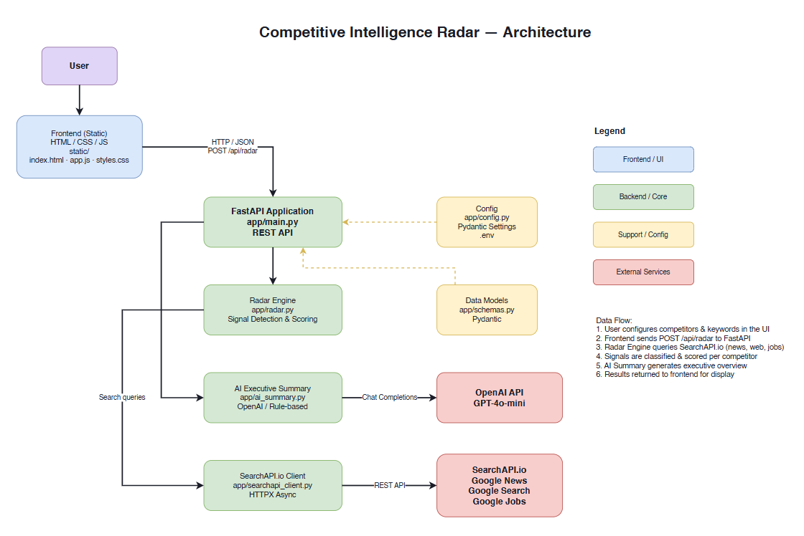

# Competitive Intelligence Radar

A FastAPI-powered competitive intelligence tool that continuously tracks competitor movements using [SearchAPI.io](https://www.searchapi.io/?utm_source=Dev&utm_medium=Ambassador&utm_campaign=ranjancse). It aggregates real-time signals from news, web, and job-posting sources, classifies them into actionable intelligence categories, and produces a ranked, scored view of which competitors are moving — and why.

The "radar" metaphor is intentional: just as a radar system scans the surrounding airspace for incoming threats, this tool sweeps the public web for the competitive signals that matter to your business — product launches, partnerships, acquisitions, pricing changes, hiring spikes, regulatory actions, and SEO shifts — so you can react before your competitors do.


## What It Does

At a glance, the Competitive Intelligence Radar empowers you to:

- **See the competitive landscape** — Get a ranked list of how active each competitor is within your chosen look-back window
- **Understand the "why" behind the signal** — Every detection is classified by type (e.g., new product, acquisition) and severity (high/medium/low), so you can prioritize which rival moves deserve attention
- **Go deeper with one click** — Each signal carries full context: the title, a snippet/description, the source engine, a direct URL to the original article, and a published date
- **Stay ahead with AI** — An OpenAI-powered executive summary distills the raw signals into a concise, boardroom-ready narrative; if no OpenAI key is configured, a deterministic rule-based fallback is used so the radar works out of the box


## Features

- **Track competitors** - Monitor any number of competitors across Google News, Google Web Search, and Google Jobs in a single run
- **Keyword monitoring** - Track industry-specific keywords (e.g., "artificial intelligence", "generative AI", "large language model", "LLM") and see which competitor is referenced in each match
- **Signal detection** - Automatically classify every hit into a fixed taxonomy of competitive signals (strategic announcements, partnerships, acquisitions, new products, hiring, SEO movement, pricing and regulatory activity, and more)
- **Severity scoring** - Each signal is rated high/medium/low, and competitors receive an aggregate competitive-movement score used for ranking
- **AI Executive Summary** - Generate professional executive summaries using OpenAI (or deterministically rule-based fallback)
- **Movement levels** - Competitors are bucketed into `none` / `low` / `medium` / `high` movement levels for instant scanning
- **Modern web UI** - Clean, responsive dashboard with list and filter controls, plus full REST API for integration
- **Fully configurable** - Defaults for competitors, keywords, days-back window, result counts, search endpoints, and classification keyword sets all live in `.env` and `config/` JSON — no code changes needed to adapt it to your industry

## Prerequisites

- Python 3.9+
- [SearchAPI.io API Key](https://www.searchapi.io/) (required)
- OpenAI API Key (optional, for AI summaries)

## Installation

1. Clone the repository:
```bash
git clone <your-repo-url>
cd competitive-intelligence-radar
```

2. Create a virtual environment:
```bash
python -m venv venv
# Windows
venv\Scripts\activate
# macOS/Linux
source venv/bin/activate
```

3. Install dependencies:
```bash
pip install -r requirements.txt
```

4. Configure environment variables:
```bash
cp .env.example .env
# Edit .env and add your SearchAPI.io API key
```

## Running the Application

```bash
uvicorn app.main:app --reload
```

Or use the provided script:
```bash
python run.py
```

The application will be available at:
- **Web UI**: http://localhost:8000
- **API Docs**: http://localhost:8000/docs
- **Health Check**: http://localhost:8000/api/health

## API Endpoints

### POST /api/radar
Run the competitive intelligence radar.

**Request Body:**
```json
{
  "competitors": ["OpenAI", "Google", "Anthropic", "Microsoft", "Meta", "Amazon", "NVIDIA", "xAI"],
  "keywords": ["artificial intelligence", "generative AI", "large language model", "LLM"],
  "days_back": 7
}
```

**Response:**
```json
{
  "competitors": [
    {
      "competitor": "Anthropic",
      "signals": [
        {
          "type": "strategic_announcement",
          "severity": "high",
          "title": "Anthropic announces new partnership",
          "description": "...",
          "url": "https://...",
          "source": "Google News"
        }
      ],
      "score": 12.5,
      "movement_level": "high",
      "summary": "Anthropic shows 3 signal(s) this period..."
    }
  ],
  "ai_executive_summary": "Anthropic shows the strongest competitive movement this week...",
  "detailed_ai_summary": "A multi-paragraph, deep-dive analysis covering each competitor, signal categorization, and strategic implications...",
  "generated_at": "2026-08-22T12:00:00",
  "total_signals": 15,
  "total_raw_results": 42,
  "search_metadata": {
    "competitors_tracked": 8,
    "keywords_monitored": 4,
    "days_back": 7,
    "search_sources": [
      "Google Jobs",
      "Google News",
      "Google News (Keyword: artificial intelligence)"
    ],
    "total_competitors_with_signals": 5
  }
}
```

### GET /api/radar
Same as POST but with query parameters:
```
/api/radar?competitors=OpenAI,Anthropic&keywords=artificial%20intelligence,generative%20AI&days_back=7
```

### GET /api/health
Check API status and configuration.

## How It Works

The radar engine runs in four stages to convert raw search results into an executive-ready competitive brief:

### 1. Search & Data Collection (SearchAPI.io Integration)

For each competitor and keyword in the request, the `SearchAPIClient` queries SearchAPI.io across three engines:

| Engine | Purpose |
|--------|---------|
| **Google News** | Latest articles mentioning the competitor or keyword (company news + keyword-specific industry news) |
| **Google Search (Web)** | General web presence, announcements, and SEO-relevant content for the competitor |
| **Google Jobs** | New / accessible job postings for the competitor |

Each search returns a configurable number of results (`SEARCH_NUM`), which is controlled from `.env`. Every result is then filtered for recency against the requested `days_back` look-back window before it becomes a candidate signal.

### 2. Signal Classification

Each candidate result's title and snippet are scanned against a **configurable keyword taxonomy** (stored in `config/signal_keywords.json`). The signal is classified into one of the following types:

| Signal Type | Example Trigger Keywords | Meaning |
|-------------|-------------------------|---------|
| **Strategic Announcement** | announce, announced, launch, launched, expansion, expands, invest, investment, initiative, strategic | Corporate strategy or expansion move |
| **Acquisition** | acquisition, acquires, merger, merges | M&A activity involving the competitor |
| **Partnership** | partnership, partners, collaboration | A strategic alliance or collaboration |
| **New Product** | new product, product launch, introduces, unveiled, new service, new platform, new tool | A product or service introduction |
| **Job Posting** | job, hiring, career | New roles being hired for (also detected directly via the Google Jobs engine) |
| **SEO Movement** | seo, search engine, website, traffic, ranking, online presence | Web-presence / keyword-rank changes |
| **Pricing Activity** | price, pricing, cost, discount, rebate, contract, negotiation, purchasing agreement | Pricing or contract changes |
| **Regulatory Activity** | regulatory, regulation, compliance, lawsuit, settlement, investigation, approval, approved, recall | Compliance, legal, or approval events |
| **News Activity** (default) | - | General mentions that don't map to the above |

The keyword taxonomy in `config/signal_keywords.json` is organized into five groups — `strategic_keywords`, `product_keywords`, `pricing_keywords`, `regulatory_keywords`, and `seo_keywords`. New keywords (or entire groups) can be added by simply editing that file — no code change required.

### 3. Movement Scoring

Each detected signal is assigned a **severity**:

| Severity | Base Points | Example |
|----------|-------------|---------|
| **High** | 3.0 | Acquisition, partnership, strategic announcement (often +2.0 bonus for M&A/partnership) |
| **Medium** | 2.0 | New product, pricing, regulatory, hiring |
| **Low** | 1.0 | SEO movement, general news activity |

Additional **type bonuses** are added on top of the base score:

| Signal Type | Bonus |
|------------|-------|
| Acquisition / Partnership | +2.0 |
| Strategic Announcement | +1.5 |
| New Product | +1.0 |
| New Jobs | +0.5 |

A competitor's **total score** is the sum of all its signal scores. Scores are mapped to **movement levels**:

| Score | Movement Level |
|-------|----------------|
| ≥ 10  | High |
| ≥ 5   | Medium |
| > 0   | Low |
| 0     | None |

Competitors are then ranked by score, giving you an instant "most-to-least active" leaderboard.

### 4. AI Executive Summary

Once signals are scored and ranked, the `AISummaryGenerator` produces a top-level narrative:

- **OpenAI mode** — If `OPENAI_API_KEY` is set, the generator uses `OPENAI_MODEL` (default `gpt-4o-mini`) to draft professional executive summaries of the competitive moves.
- **Fallback mode** — If no API key is provided, a deterministic rule-based summary is generated from the top signals, so the radar always produces an output even without a paid key.
- **Two output levels** — Every radar response includes both a concise `ai_executive_summary` and a longer `detailed_ai_summary` (a multi-paragraph analysis covering each competitor, signal categorization, and strategic implications); both honor the OpenAI/fallback behavior described above.


## Use Cases

Competitive Intelligence Radar is designed to serve a wide range of go-to-market and strategy roles:

- **Product & Marketing Teams** — Track when competitors launch new products, change pricing, or reposition their messaging (via SEO/web signal) so you can adjust your own roadmap and positioning.
- **Business Development** — Watch for partnership and acquisition announcements in your market to identify potential partners or detect consolidation threats.
- **Sales Teams** — Get early warning when a competitor signs a major contract, expands territories, or launches a new pricing model, so reps can prepare counter-narratives.
- **Executive / Board Reporting** — The AI executive summary and movement scores distill noisy web data into a single, digestible status page for leadership reviews.
- **Market Research** — Combine keyword monitoring (e.g., "artificial intelligence", "generative AI", "large language model", "LLM") with competitor filtering to build a curated view of the market's current dynamics.

## Project Structure

```
competitive-intelligence-radar/
├── app/
│   ├── __init__.py
│   ├── ai_summary.py       # AI executive summary generation
│   ├── config.py           # Configuration management (loads from .env + config/)
│   ├── main.py             # FastAPI application
│   ├── radar.py            # Radar engine and signal detection
│   ├── schemas.py          # Pydantic models
│   └── searchapi_client.py # SearchAPI.io client
├── assets/
│   ├── AI Executive Summary.png              # Screenshot of the AI summary UI section
│   ├── Architecture.png                      # System architecture diagram (PNG render)
│   ├── Competitive Intelligence Radar.png    # Main dashboard screenshot
│   ├── COMPETITIVE RADAR.png                 # Results / ranked leaderboard screenshot
│   └── Detailed Analysis.png                 # Screenshot of the detailed analysis UI section
├── config/
│   ├── defaults.json        # Default radar values (competitors, keywords, days_back)
│   └── signal_keywords.json # Signal classification keywords (configurable)
├── docs/
│   ├── architecture.drawio # Architecture diagram (open in draw.io)
│   └── blog-post.md
├── static/
│   ├── app.js             # Frontend JavaScript
│   ├── index.html         # Frontend HTML
│   └── styles.css         # Frontend styles
├── .env                   # Environment configuration (not committed to git)
├── .env.example           # Environment template
├── requirements.txt       # Python dependencies
└── run.py                 # Development server script
```

## Architecture Diagram



The diagram above shows how the system is wired together — from the static frontend and FastAPI application layer, through the radar engine (signal detection & scoring), to the external services (SearchAPI.io and OpenAI). An editable copy is also available in `docs/architecture.drawio`. Open it with [draw.io](https://app.diagrams.net/) to view or modify the architecture, including:

- Frontend (static HTML/CSS/JS)
- FastAPI application layer
- Radar engine with signal detection & scoring
- AI executive summary generation
- SearchAPI.io client integration
- External services (SearchAPI.io, OpenAI)
- Data flow between components

## Configuration

| Variable | Description | Required | Default |
|----------|-------------|----------|---------|
| `SEARCHAPI_API_KEY` | Your SearchAPI.io API key | Yes | - |
| `SEARCHAPI_BASE_URL` | SearchAPI.io API base URL | No | `https://www.searchapi.io/api/v1/search` |
| `OPENAI_API_KEY` | OpenAI API key for AI summaries | No | - |
| `OPENAI_MODEL` | OpenAI model to use | No | `gpt-4o-mini` |
| `SEARCH_NUM` | Number of search results per query | Yes | `10` |
| `SIGNAL_KEYWORDS_PATH` | Path to the signal keywords JSON config file | No | `config/signal_keywords.json` |

### Config File: `config/defaults.json`

Default radar request values are configured in `config/defaults.json` (not environment variables):

| Key | Description | Default |
|-----|-------------|---------|
| `default_competitors` | Default competitors for radar requests | `["OpenAI", "Google", "Anthropic", "Microsoft", "Meta", "Amazon", "NVIDIA", "xAI"]` |
| `default_keywords` | Default keywords for radar requests | `["artificial intelligence", "generative AI", "large language model", "LLM"]` |
| `default_days_back` | Default look-back window in days | `7` |

## License

MIT